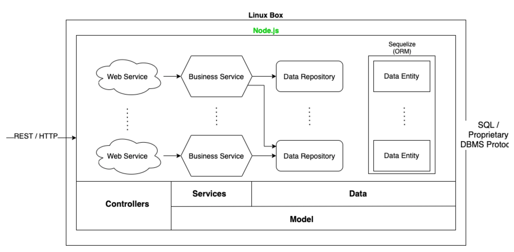

# FLOW

Banking software represents a concrete example of enterprise software held to high standards, which is obviously due to the nature of the business. **The idea behind this project is to build web application honoring similar specifications.** The web application is essentially a retail banking application aimed at the general public, it offers some of the core banking services; these include handling personal and business credit lines and money transactions. FLOW is written in Javascript in the runtime environment Node.js. The web application is built using the following technologies: _ExpressJS, Sequelize (ORM), PostgreSQL (dialect), Redis, REST & JWT for authentication._

## Requirements

### Functional Requirements

- **ROLES / ACTORS**

  - [x] There are three types of actors: customer, back office staff and admin.

- **CUSTOMER FUNCTIONALITIES**

  - [x] A customer shall be able to create an account (customer role).
  - [x] A customer shall be able to add a card (personal or business).
  - [x] A customer shall be able to view his card information.
  - [x] A customer shall be able to block a card.
  - [x] A customer shall be able to make a request to delete a card.
  - [x] A customer shall be able to request the deletion of his account.
  - [x] A customer shall be able to make a transfer.
  - [x] A customer shall be able to view and download a transfer receipt.
  - A customer shall be able to browse transfers by date.
  - A customer shall be able to search for transfers by name of the receiving party.
  - [x] A customer shall be able to view and download their track of transfers of at least 90 days.
  - [x] A customer shall be able to make a request for personal or business credit line (the card is created and assigned the user directly if they don’t have the respective type of card) by agreeing to various interest rates and terms proposed by the bank.

- **BACK OFFICE STAFF FUNCTIONALITIES**

  - A back office admin shall be able to view and validate the credit line requests.
  - A back office admin shall be able to view a customer credit line history.
  - A back office admin shall be able to browse customer track of transfers by date.
  - A back office admin shall be able to view and validate account deletion requests.
  - A back office admin shall be able to search for transfers by the name (sending and receiving).

- **ADMIN FUNCTIONALITIES**
  - A default admin shall be created automatically
  - An admin shall be able to create other back office staff accounts.
  - An admin shall be able to search for back office staff by name.
  - An admin shall be able to view back office staff details.
  - An admin shall be able to view back office staff validated requests

### Non-functional Requirements

- **ACCESS**
  - The application shall be accessible through laptop and browser.
- **PERFORMANCE**
  - The system shall allow the client to pass Google Lighthouse performance test on laptop and mobile with at least 90%.
- **SCALABILITY**
  - The system shall scale out to preserve performance even when the load grows, at a reasonable cost.
- **SECURITY**
  - The confidentiality and integrity of all data traffic shall be protected.
  - The authenticity of both the client and the server shall be ensured.

## **Architecture**

- **Physical Architecture - Initial**
<p align="center">
  
</p>

- **Physical Architecture - Protocols & Software**
<p align="center">
  
</p>

- **Physical Architecture - Scalable**
<p align="center">
  
</p>

- **Logical Architecture - Inside an Application Server**
<p align="center">
  
</p>

## Design

### Class Diagrams

- **Entity Class Diagram**
<p align="center">
  
</p>
- **Repositories and Services Class Diagram**
<p align="center">
  
</p>

### Sequence Diagrams

- **Data-driven Sequence Diagram**
<p align="center">
  
</p>

- **Service-driven Sequence**
<p align="center">
  
</p>

## Development

**Starting point**
_You need to install Docker, in addition to setting up the environment for the containers dpage/pgadmin4 & postgres.
Then run these commands_

- Clone this repository

```
  cd src/
  npm run dev
```
